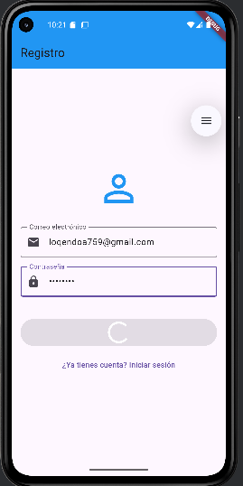
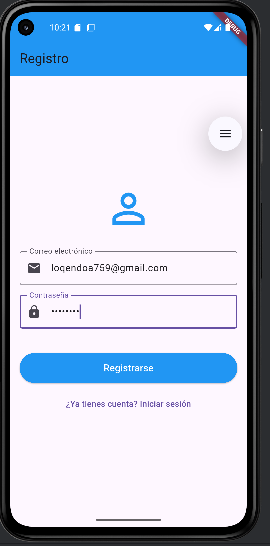
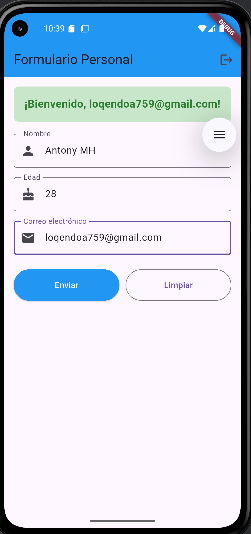
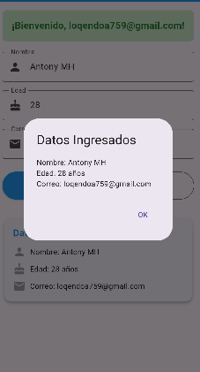
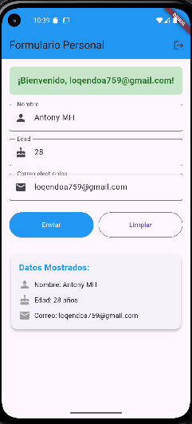

# Proyecto Final Flutter

## Descripción del Proyecto

Esta es una aplicación móvil desarrollada en Flutter que incluye un formulario de ingreso de datos personales con validación completa y sistema de autenticación usando Firebase Authentication.

## Características Principales

### Autenticación Firebase
- **Registro de usuarios** con email y contraseña
- **Inicio de sesión** seguro
- **Validación de credenciales** con mensajes de error descriptivos
- **Manejo de estados de autenticación** automático
- **Cerrar sesión** funcional

### Formulario Validado
- **Campos requeridos:**
    - Nombre (obligatorio, no vacío)
    - Edad (obligatorio, número entero mayor que 0 y menor que 120)
    - Correo electrónico (formato válido con regex)

### Validaciones Implementadas
- Campos no vacíos
- Formato de email válido
- Edad numérica y dentro de rango realista
- Contraseña mínima de 6 caracteres
- Mensajes de error específicos y claros

### Manejo de Estado
- Uso explícito de `setState()` para actualizar la interfaz
- Estados de carga durante autenticación
- Actualización dinámica de datos mostrados
- Limpieza de formularios

## Capturas de Pantalla

### Pantalla de Login/Registro
La aplicación inicia con una pantalla de autenticación donde el usuario puede:
- Alternar entre modo registro e inicio de sesión
- Ingresar email y contraseña
- Ver mensajes de error o éxito
- Acceder con indicador de carga

### Pantalla Principal (Formulario)
Una vez autenticado, el usuario accede a:
- Mensaje de bienvenida personalizado
- Formulario de datos personales
- Validación en tiempo real
- Botones para enviar y limpiar
- Visualización de datos ingresados en tarjeta
- Opción de cerrar sesión

### Diálogo de Confirmación
Al enviar el formulario válido:
- AlertDialog muestra los datos ingresados
- Confirmación de que la información fue procesada
- Opción para cerrar el diálogo

## 🛠Uso de la Aplicación

### Primer Uso (Registro)
1. **Abrir la aplicación**
2. **Seleccionar "Registrarse"**
3. **Ingresar email y contraseña** (mínimo 6 caracteres)
4. **Presionar "Registrarse"**
5. **Esperar confirmación** de registro exitoso

### Inicio de Sesión
1. **Ingresar credenciales** registradas
2. **Presionar "Iniciar Sesión"**
3. **Acceder automáticamente** al formulario

### Llenar Formulario
1. **Completar todos los campos:**
    - Nombre completo
    - Edad (número entero positivo)
    - Email válido
2. **Presionar "Enviar"** para validar
3. **Ver datos** en el diálogo de confirmación
4. **Los datos se muestran** también en una tarjeta debajo del formulario